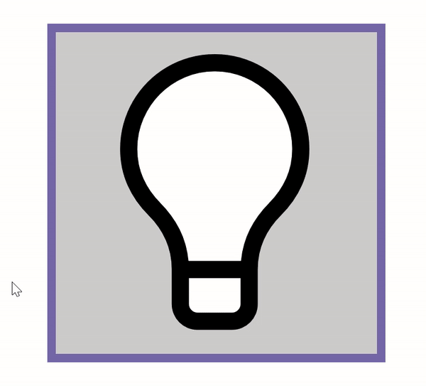

# Interactive Segments on an Animation Timeline

Lottie-Windows may be used to create interactive controls such as animated icons or first-run experiences which may be comprised of several behaviors that depend upon the user's input. Instead of using multiple JSON files, it’s possible to use a single Lottie animation with multiple segments designed into its timeline.
For instance, the following ToggleButton behaviors are contained in `LightBulb.json`'s animation timeline:

* Unchecked: static frame at progress 0.
* Pointer Hovered: animation segment between 0 and 0.35, looped.
* Pointer Clicked: animation segment between 0.35 and 1, play once.
* Checked: static frame at progress 1.

To configure the playback of the relevant animation segments based on `PointerEntered/Exited/Pressed` events, we build upon the previous scenarios as follows:

```xaml
    <Border Style="{StaticResource LottiePlayer}">
        <!--AnimatedVisualPlayer with AutoPlay disabled-->
        <controls:AnimatedVisualPlayer x:Name="player"
                                       AutoPlay="False"
                                       x:Name="player"
                                       PointerEntered="Player_PointerEntered"
                                       PointerExited="Player_PointerExited"
                                       PointerPressed="Player_PointerPressed">
            <!--Codegen class AnimatedVisuals/LightBulb.cs-->
            <animatedvisuals:LightBulb/>
        </controls:AnimatedVisualPlayer>
    </Border>
```

```C#
    private static readonly (double fromProgress, double toProgress, bool looping) s_hoveredSegment = (0, 0.35, true);
    private static readonly (double fromProgress, double toProgress, bool looping) s_clickedSegment = (0.35, 1, false);
    private bool _isChecked;

    private void Player_PointerEntered(object sender, PointerRoutedEventArgs e)
    {
        if (player.IsPlaying)
        {
            // Must be playing "Clicked": do nothing.
        }
        else
        {
            if (!_isChecked)
            {
                // Play "Hovered" segment of the animation.
                _ = player.PlayAsync(s_hoveredSegment.fromProgress, s_hoveredSegment.toProgress, s_hoveredSegment.looping);
            }
        }
    }

    private void Player_PointerExited(object sender, PointerRoutedEventArgs e)
    {
        if (player.IsPlaying && !_isChecked)
        {
            // Stop playing "Hovered" segment, which also resets the animation to its initial frame.
            player.Stop();
        }
    }

    private void Player_PointerPressed(object sender, PointerRoutedEventArgs e)
    {
        if (_isChecked)
        {
            // Reset to Unchecked state if already Checked.
            _isChecked = false;
            player.SetProgress(0);
        }
        else
        {
            // Play "Clicked" segment of the animation.
            _isChecked = true;
            _ = player.PlayAsync(s_clickedSegment.fromProgress, s_clickedSegment.toProgress, s_clickedSegment.looping);
        }
    }

```

This results in the following interactive animated ToggleButton icon:



## Resources

* [Source code](https://github.com/windows-toolkit/Lottie-Windows/blob/master/samples/LottieSamples/Scenarios/SegmentsPage.xaml.cs) for sample: interactive segments on an animation timeline
* The resulting page in the [Lottie Samples application](http://aka.ms/lottiesamples)
* [AnimatedVisualPlayer](https://docs.microsoft.com/uwp/api/microsoft.ui.xaml.controls.animatedvisualplayer) API reference
* [Help + feedback](https://github.com/windows-toolkit/Lottie-Windows/issues)