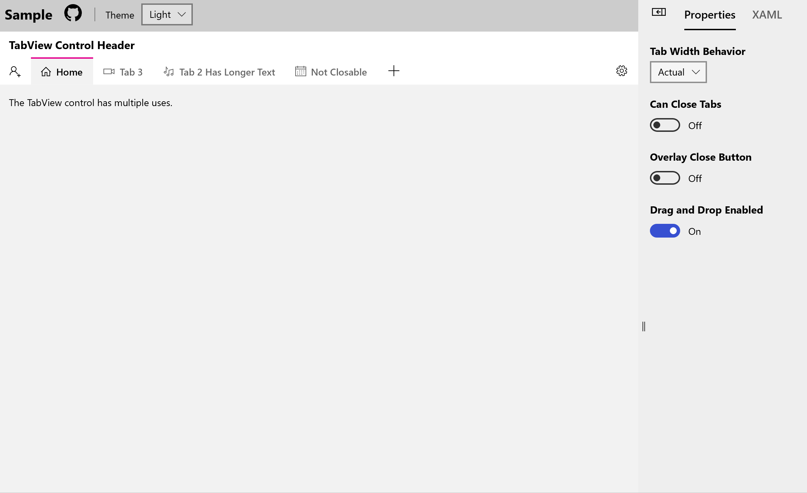

# Title
The [TabView](https://docs.microsoft.com/dotnet/api/microsoft.toolkit.uwp.ui.controls.tabview) displays a set of [TabViewItem](https://docs.microsoft.com/dotnet/api/microsoft.toolkit.uwp.ui.controls.tabviewitem) in a shared container.

<!-- Use below format to display note
> [!NOTE]
Some note

> [!IMPORTANT]
Some important note

> [!WARNING]
Some warning note
-->

## Syntax

```csharp

```
<!-- VB.Net samples are optional. If included, 'vb' should also be listed in the 'dev_langs' defined in the header. Code Blocks will be combined if there is no other content between different Code Block languages.
```vb

```
-->

```xaml
<controls:TabView x:Name="Tabs">
  <controls:TabViewItem Header="Home">
    <TextBlock Padding="16">The TabView control has multiple uses.</TextBlock>
  </controls:TabViewItem>
  <controls:TabViewItem Header="Tab 2">
    <TextBlock Padding="16">A 2nd Tab.</TextBlock>
  </controls:TabViewItem>
</controls:TabView>
```

## Sample Output

 

## Properties

### TabView Properties

| Property | Type | Description |
| -- | -- | -- |
| CanCloseTabs | bool | Default value for if the TabViewItem doesn't specify a IsClosable value. |
| IsCloseButtonOverlay | bool | Changes the behavior of how the Close button effects layout.  If True, the close button will overlay itself on top of content if the tab is a fixed size. |
| ItemHeaderTemplate | DataTemplate | Default Template for the TabViewItem Header if no template is specified. |
| SelectedTabWidth | double | Size to set the Selected Tab Header.  Defaults to Auto. |
| TabActionHeader | object | Area to the Right of Tab Strip before Padding. |
| TabActionHeaderTemplate | DataTemplate | Template for the TabActionHeader. |
| TabEndHeader | object | Area to the Right of the Tab Strip after Padding. |
| TabEndHeaderTemplate | DataTemplate | Template for the TabEndHeader. |
| TabStartHeader | object | Description Area to the Left of the Tab Strip. |
| TabStartHeaderTemplate | DataTemplate | Template for the TabStartHeader. |
| TabWidthBehavior | TabWidthMode | Actual, Equal, or Compact values specify how Tab Headers should be sized.  Defaults to Actual. |

> [!IMPORTANT]
Do not use `ItemsStackPanel` if you override the ItemsPanel.  It is suggested to keep the `TabWidthBehavior` to `Actual` when using a custom panel.

### TabViewItem Properties

| Property | Type | Description |
| -- | -- | -- |
| Content | object | Main Tab Content. |
| Header | object | Header Content of the Tab. |
| HeaderTemplate | DataTemplate | Template for the Header object. |
| Icon | IconElement | Icon of the Tab. |
| IsClosable | bool | Set to true for the TabViewItem to show a close button. |

## Events

### TabView Events

| Events | Description |
| -- | -- |
| TabClosing | Fires when a Tab is about to be closed, can be intercepted to prevent closure. |
| TabDraggedOutside | Fires when a Tab is dragged outside of the Tab bar. |

### TabViewItem Events
| Events | Description |
| -- | -- |
| TabClosing | Fires when a Tab's closed button is clicked. |

## Examples

<!-- All control/helper must at least have an example to show the use of Properties and Methods in your control/helper with the output -->
<!-- Use <example> and <code> tags in C# to create a Propertie/method specific examples. For more info - https://docs.microsoft.com/dotnet/csharp/programming-guide/xmldoc/example -->
<!-- Optional: Codes to achieve real-world use case with the output. For eg: Check https://docs.microsoft.com/windows/communitytoolkit/animations/animationset#examples  -->

## Sample Code

[TabView Sample Page Source](https://github.com/windows-toolkit/WindowsCommunityToolkit/tree/master/Microsoft.Toolkit.Uwp.SampleApp/SamplePages/TabView). You can see this in action in [Windows Community Toolkit Sample App](https://www.microsoft.com/store/apps/9NBLGGH4TLCQ).

## Default Template 

[TabView XAML File](https://github.com/windows-toolkit/WindowsCommunityToolkit/blob/master/Microsoft.Toolkit.Uwp.UI.Controls/TabView/TabView.xaml) is the XAML template used in the toolkit for the default styling.

## Requirements

| Device family | Universal, MinVersion or higher   |
| -- | -- |
| Namespace |  |
| Microsoft.Toolkit.Uwp.UI.Controls | [Microsoft.Toolkit.Uwp.UI.Controls](https://www.nuget.org/packages/Microsoft.Toolkit.Uwp.UI.Controls/) |

## API Source Code

- [BladeView source code](https://github.com/Microsoft/WindowsCommunityToolkit//tree/master/Microsoft.Toolkit.Uwp.UI.Controls/BladeView)


## Related Topics

- [IconElement](https://docs.microsoft.com/en-us/uwp/api/Windows.UI.Xaml.Controls.IconElement)
- [TabControl (WPF)](https://docs.microsoft.com/en-us/dotnet/api/system.windows.controls.tabcontrol)
