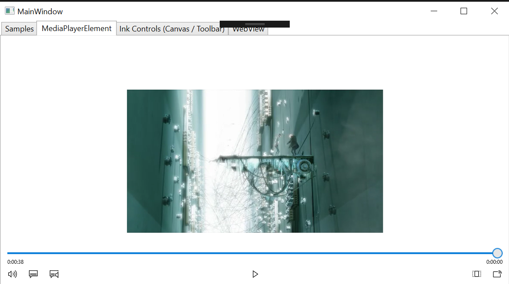

# MediaPlayerElement control for Windows Forms and WPF

> [!NOTE]
> This control is currently available as a developer preview. Although we encourage you to try out this control in your own prototype code now, we do not recommend that you use it in production code at this time. This control will continue to mature and stabilize in future toolkit releases. If you have feedback about this control, create a new issue in the [WindowsCommunityToolkit repo](https://github.com/windows-toolkit/WindowsCommunityToolkit/issues) and leave your comments there. If you prefer to submit your feedback privately, you can send it to XamlIslandsFeedback@microsoft.com. Your insights and scenarios are critically important to us.

The **MediaPlayerElement** control embeds a view that streams and renders media content such as video in your Windows Forms or WPF desktop application. This is one of several wrapped Universal Windows Platform controls that are available for Windows Forms and WPF applications. For more information, see [UWP controls in desktop applications](https://docs.microsoft.com/windows/uwp/xaml-platform/xaml-host-controls).



## About MediaPlayerElement control

The WPF version of this control is located in the **Microsoft.Toolkit.Wpf.UI.Controls** namespace. The Windows Forms version is located in the **Microsoft.Toolkit.Forms.UI.Controls** namespace. You can find additional related types (such as enums and event args classes) in the **Microsoft.Toolkit.Win32.UI.Controls.Interop.WinRT** namespace.

This control wraps an instance of the UWP [Windows.UI.Xaml.Controls.MediaPlayerElement](https://docs.microsoft.com/uwp/api/Windows.UI.Xaml.Controls.MediaPlayerElement) control.

## Known issues and limitations

* This controls does not currently support full screen video.
* The **Source** property is exposed as a string, which is interpreted as a URL and bound to the **Source** property of the wrapped UWP control as a UWP-implemented **IMediaPlaybackSource**.
* See also our list of [known issues](https://github.com/windows-toolkit/WindowsCommunityToolkit/issues?utf8=%E2%9C%93&q=is:issue+is:open+label:XamlIslands+label:bug) for WPF and Windows Forms controls in the Windows Community Toolkit repo.

## Syntax
```xaml
<Window x:Class="TestSample.MainWindow" ...
  xmlns:controls="clr-namespace:Microsoft.Toolkit.Wpf.UI.Controls;assembly=Microsoft.Toolkit.Wpf.UI.Controls"
...>

<controls:MediaPlayerElement x:Name="mediaPlayerElement"
    Source="https://mediaplatstorage1.blob.core.windows.net/windows-universal-samples-media/elephantsdream-clip-h264_sd-aac_eng-aac_spa-aac_eng_commentary-srt_eng-srt_por-srt_swe.mkv"
    AutoPlay="True" Margin="5" HorizontalAlignment="Stretch"  VerticalAlignment="Stretch" AreTransportControlsEnabled="True" />
```

## Properties

The following properties wrap corresponding [properties](https://docs.microsoft.com/uwp/api/Windows.UI.Xaml.Controls.MediaPlayerElement#properties) of the wrapped UWP [Windows.UI.Xaml.Controls.MediaPlayerElement](https://docs.microsoft.com/uwp/api/Windows.UI.Xaml.Controls.MediaPlayerElement) object. See the links in this table for more information about each property.

| Property | Type | Description |
| -- | -- | -- |
| AreTransportControlsEnabled | bool | Wraps the [AreTransportControlsEnabled](https://docs.microsoft.com/uwp/api/windows.ui.xaml.controls.mediaplayerelement.aretransportcontrolsenabled) property. |
| AreTransportControlsEnabledProperty | DependencyProperty | Dependency property for the **AreTransportControlsEnabled** property. |
| AutoPlay | bool | Wraps the [AutoPlay](https://docs.microsoft.com/uwp/api/windows.ui.xaml.controls.mediaplayerelement.autoplay) property. |
| AutoPlayProperty | DependencyProperty | Dependency property for the **ActiAutoPlayveTool** property. |
| IsFullWindow | bool | Wraps the [IsFullWindow](https://docs.microsoft.com/uwp/api/windows.ui.xaml.controls.mediaplayerelement.isfullwindow) property. |
| IsFullWindowProperty | DependencyProperty | Dependency property for the **IsFullWindow** property. |
| MediaPlayer | MediaPlayer | Wraps the [MediaPlayer](https://docs.microsoft.com/uwp/api/windows.ui.xaml.controls.mediaplayerelement.mediaplayer) property. |
| MediaPlayerProperty | DependencyProperty | Dependency property for the **MediaPlayer** property. |
| PosterSource | ImageSource | Wraps the [PosterSource](https://docs.microsoft.com/uwp/api/windows.ui.xaml.controls.mediaplayerelement.postersource) property. |
| PosterSourceProperty | DependencyProperty | Dependency property for the **PosterSource** property. |
| Source | string | Wraps the [Source](https://docs.microsoft.com/uwp/api/windows.ui.xaml.controls.mediaplayerelement.source) property. The **Source** property of this wrapped control is exposed as a string, which is interpreted as a URL and bound to the **Source** property of the wrapped UWP control as a UWP-implemented **IMediaPlaybackSource**.|
| SourceProperty | DependencyProperty | Dependency property for the **Source** property. |
| Stretch | Stretch | Wraps the [Stretch](https://docs.microsoft.com/uwp/api/windows.ui.xaml.controls.mediaplayerelement.stretch) property. |
| StretchProperty | DependencyProperty | Dependency property for the **Stretch** property. |
| TransportControls | MediaTransportControls | Wraps the [TransportControls](https://docs.microsoft.com/uwp/api/windows.ui.xaml.controls.mediaplayerelement.transportcontrols) property. |

## Methods


| Methods | Return Type | Description |
| -- | -- | -- |
| SetMediaPlayer(MediaPlayer) | void | Wraps the [SetMediaPlayer](https://docs.microsoft.com/uwp/api/windows.ui.xaml.controls.mediaplayerelement.setmediaplayer) method of the wrapped UWP **MediaPlayerElement** control. |


## Requirements

|        |        |
|--------|--------|
| Device family | .NET 4.6.2, Windows 10 (introduced v10.0.17709.0) |
| Namespace | Windows Forms: Microsoft.Toolkit.Forms.UI.Controls <br/> WPF: Microsoft.Toolkit.Wpf.UI.Controls |
| NuGet package | Windows Forms: [Microsoft.Toolkit.Forms.UI.Controls](https://www.nuget.org/packages/Microsoft.Toolkit.Forms.UI.Controls)  <br/> WPF: [Microsoft.Toolkit.Wpf.UI.Controls](https://www.nuget.org/packages/Microsoft.Toolkit.Wpf.UI.Controls) |

## API source code

- [MediaPlayerElement (Windows Forms)](https://github.com/windows-toolkit/Microsoft.Toolkit.Win32/tree/master/Microsoft.Toolkit.Forms.UI.Controls/MediaPlayerElement)
- [MediaPlayerElement (WPF)](https://github.com/windows-toolkit/Microsoft.Toolkit.Win32/tree/master/Microsoft.Toolkit.Wpf.UI.Controls/MediaPlayerElement)


## Related topics

- [MediaPlayerElement (UWP)](https://docs.microsoft.com/uwp/api/Windows.UI.Xaml.Controls.MediaPlayerElement)
- [Media playback](https://docs.microsoft.com/windows/uwp/design/controls-and-patterns/media-playback)
