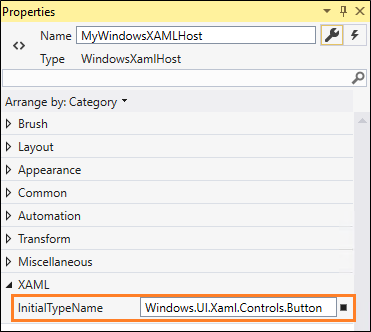
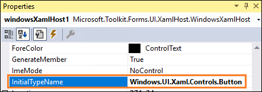
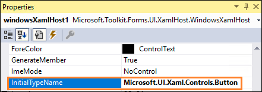
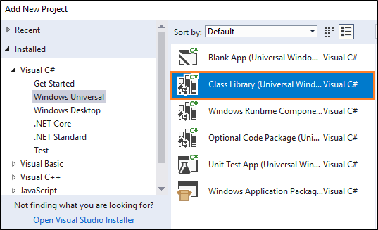
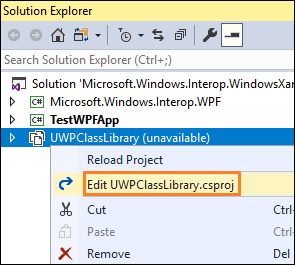
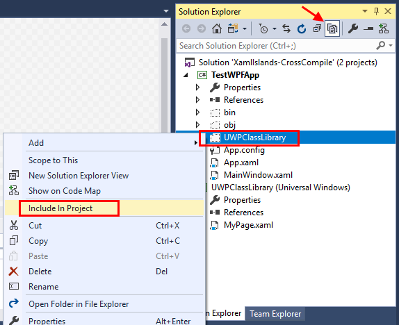
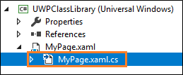
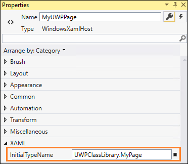

# WindowsXamlHost control for Windows Forms and WPF

By using the **WindowsXamlHost** control, you can add built-in or custom Universal Windows Platform (UWP) controls to your WPF or Windows Forms desktop application. This is one of several ways to host UWP controls in Windows Forms and WPF applications as part of a feature called *XAML Islands*. For more information, see [UWP controls in desktop applications (XAML Islands)](https://docs.microsoft.com/windows/uwp/xaml-platform/xaml-host-controls).

> [!NOTE]
> This control is currently available as a developer preview for Windows 10, version 1903, and later. Although we encourage you to try out this control in your own prototype code now, we do not recommend that you use it in production code at this time. For more information, see the [XAML Islands feature roadmap](https://docs.microsoft.com/windows/uwp/xaml-platform/xaml-host-controls#feature-roadmap). If you have feedback about this control, create a new issue in the [Microsoft.Toolkit.Win32 repo](https://github.com/windows-toolkit/Microsoft.Toolkit.Win32/issues) and leave your comments there. If you prefer to submit your feedback privately, you can send it to XamlIslandsFeedback@microsoft.com.

> [!div class="nextstepaction"]
> [Try it in the sample app](uwpct://WPFandWinFormsControls?sample=WindowsXamlHost)

## Get started

To get started using the **WindowsXamlHost** control:

1. Follow [these instructions](https://docs.microsoft.com/windows/uwp/xaml-platform/xaml-host-controls#requirements) to configure your project to support XAML Islands.
2. Install the appropriate Nuget package:
    * For WPF applications, install the [Microsoft.Toolkit.Wpf.UI.XamlHost](https://www.nuget.org/packages/Microsoft.Toolkit.Wpf.UI.XamlHost) package.
    * For Windows Forms applications, install the [Microsoft.Toolkit.Forms.UI.XamlHost](https://www.nuget.org/packages/Microsoft.Toolkit.Forms.UI.XamlHost) package.


## Known issues and limitations

See our list of [known issues](https://github.com/windows-toolkit/WindowsCommunityToolkit/issues?utf8=%E2%9C%93&q=is:issue+is:open+label:XamlIslands+label:bug) for WPF and Windows Forms controls in the Windows Community Toolkit repo.

## Add a Windows XAML host control

In the Visual Studio **Toolbox** window, find the **WindowsXamlHost** control, and then drag it onto the designer of your WPF or Windows Forms application.

You'll find the **WindowsXamlHost** control in the **Windows Community Toolkit** section of the Visual Studio **Toolbox**.

### Specify a UWP control type

In the **Properties** window, set the **InitialTypeName** property to the fully qualified name of the UWP control that you want associate with the **WindowsXamlHost** control.

You'll find the **InitialTypeName** property in the **XAML** section of the **Properties** window.

**WPF**



**Windows Forms**



### Initialize the UWP control

In the **Properties** window, double-click the **ChildChanged** field to generate an event handler.

**WPF**


**Windows Forms**



Initialize your UWP control by adding code to this handler. Your code can set properties and handle the events of the UWP control. Here's a basic example that sets a property and handles an event of a UWP **Button** class.

```csharp

private void MyWindowsXAMLHost_ChildChanged(object sender, EventArgs e)
{
    WindowsXamlHost windowsXamlHost = (WindowsXamlHost)sender;

    Windows.UI.Xaml.Controls.Button button =
        (Windows.UI.Xaml.Controls.Button)windowsXamlHost.Child;

    button.Content = "My UWP button";
    button.Click += Button_Click;
}

private void Button_Click(object sender, Windows.UI.Xaml.RoutedEventArgs e)
{
    MessageBox.Show("My UWP button works");
}
```

If you don't want to initialize UWP controls in the **ChildChanged** event, you can create instances of UWP controls by using the **CreateXamlContentByType** convenience method. Before you show that control in the UI of your application, you'll have to associate it with a Windows XAML host control.

Here's an example that demonstrates how to do this. This example assumes that the code is run in the context of a **Window** that contains a **StackPanel** named **MyStackPanel**.

```csharp
private void UseHelperMethod()
{
    WindowsXamlHost myHostControl = new WindowsXamlHost();

    // Use helper method to create a UWP control instance.
    Windows.UI.Xaml.Controls.Button myButton =
        Microsoft.Toolkit.Win32.UI.XamlHost.UWPTypeFactory.CreateXamlContentByType(
            "Windows.UI.Xaml.Controls.Button") as Windows.UI.Xaml.Controls.Button;

    // Initialize UWP control.
    myButton.Name = "button1";
    myButton.Width = 75;
    myButton.Height = 40;
    myButton.TabIndex = 0;
    myButton.Content = "button1";
    myButton.Click += MyButton_Click;

    // initialize the Windows XAML host control.
    myHostControl.Name = "myWindowsXamlHostControl";

    // Associate the Windows XAML host control with the UWP control.
    // For Windows Forms applications, you might use this.Controls.Add(myHostControl);
    myHostControl.Child = myButton;

    // Make the UWP control appear in the UI.
    this.MyStackPanel.Children.Add(myHostControl);
}

private void MyButton_Click(object sender, Windows.UI.Xaml.RoutedEventArgs e)
{
    MessageBox.Show("My Button Worked");
}
```

## Initialize UWP controls first, and then assign them to Windows XAML host controls

In some situations, you might want to create instances of UWP controls without having to first create Windows XAML host controls.

If you choose to do this, make sure to first call the [InitializeForCurrentThread](https://docs.microsoft.com/uwp/api/windows.ui.xaml.hosting.windowsxamlmanager.initializeforcurrentthread) method of the [WindowsXamlManager](https://docs.microsoft.com/uwp/api/windows.ui.xaml.hosting.windowsxamlmanager) class. This initializes the UWP hosting environment so that you can create and initialize UWP controls. You can create a Windows XAML host control when you are ready to show any of those UWP controls in a UI. 

Before you can call this method, you must first add a reference to Windows.UI.Xaml.Hosting.HostingContract.winmd in your project (this is in addition to the other references you already added to your project earlier by following [these instructions](https://docs.microsoft.com/windows/uwp/xaml-platform/xaml-host-controls#requirements)).

1. In your project, open the **Reference Manager** dialog box, choose the **Browse** button, and then select  **All Files** in the drop-down next to **File Name**.
2. Navigate to the C:\Program Files (x86)\Windows Kits\10\References\\<*sdk version*>\Windows.UI.Xaml.Hosting.HostingContract\<*version*> folder, select Windows.UI.Xaml.Hosting.HostingContract.winmd, and then click **Add**.

The following example initializes the UWP hosting environment, creates a UWP button and then creates a Windows XAML host control only for the purpose of showing the UWP control in the UI.

```csharp
private void CreateUWPControlsFirst()
{
    // Initialize the UWP hosting environment.
    global::Windows.UI.Xaml.Hosting.WindowsXamlManager.InitializeForCurrentThread();

    // Create a UWP control.
    Windows.UI.Xaml.Controls.Button myButton = new Windows.UI.Xaml.Controls.Button();

    // Initialize UWP control.
    myButton.Name = "button1";
    myButton.Width = 75;
    myButton.Height = 40;
    myButton.TabIndex = 0;
    myButton.Content = "button1";
    myButton.Click += MyButton_Click;

    // Create a Windows XAML host control.
    WindowsXamlHost myHostControl = new WindowsXamlHost();

    // initialize the Windows XAML host control.
    myHostControl.Name = "myWindowsXamlHostControl";

    // Associate the Windows XAML host control with the UWP control.
    myHostControl.Child = myButton;

    // Make the UWP control appear in the UI.
    // For Windows Forms applications, you might use this.Controls.Add(myHostControl);
    this.MyStackPanel.Children.Add(myHostControl);
}

private void MyButton_Click(object sender, Windows.UI.Xaml.RoutedEventArgs e)
{
    MessageBox.Show("My Button Worked");
}
```

## Add a custom UWP control

You can add a custom control that contains one or more UWP controls and custom functionality. To do this, you'll configure two projects: A UWP class library project, and the WPF or Windows Forms application project.

The following instructions uses a WPF project.

### Configure a UWP class library project

1. First, add a **Class Library (Universal Windows)** project to your solution.

    

2. In **Solution Explorer**, right-click the class library project, and then choose **Add -> New Item**. Select **Blank Page**, give it a name and click **Add**.

2. In **Solution Explorer**, right-click the class library project, and choose **Unload Project**. Then, right-click the class library project, and choose **Edit `<Your project name>`** to open it in the Visual Studio code editor.

    

3. In the project file, locate the following line.

    ```xml
    <Import Project="$(MSBuildExtensionsPath)\Microsoft\WindowsXaml\v$(VisualStudioVersion)\Microsoft.Windows.UI.Xaml.CSharp.targets" />
    ```

3. Immediately **before** the ``<Import>`` element for the Microsoft.Windows.UI.Xaml.CSharp.targets file, add the following lines. If you don't put these before the ``<Import>`` element, you may see errors compiling XamlTypeInfo.g.cs in your host project.

    ```xml
    <PropertyGroup>
      <EnableTypeInfoReflection>false</EnableTypeInfoReflection>
      <EnableXBindDiagnostics>false</EnableXBindDiagnostics>
    </PropertyGroup>
    ```

4. Immediately **after** the ``<Import>`` element for the Microsoft.Windows.UI.Xaml.CSharp.targets file, add the following lines and then set the value of the ``<HostFrameworkProject>`` element to the name of your WPF project. If you don't put these lines after the ``<Import>`` element, the **$(TargetDir)**, **$(ProjectDir)**, and **$(ProjectName)** project variables will not be defined and you will see copy errors and the post-build event failures.

    ```xml
    <PropertyGroup>
      <HostFrameworkProject>YOUR_WPF_PROJECT_NAME</HostFrameworkProject>
    </PropertyGroup>
    <PropertyGroup>
    <!-- Copy source and build output files to hostapp folders -->
    <!-- Default Winforms/WPF projects do not use $Platform for build output folder -->
      <PostBuildEvent>
        xcopy "$(TargetDir)*.xbf"            "$(SolutionDir)$(HostFrameworkProject)\bin\$(Configuration)\$(ProjectName)\" /Y
        xcopy "$(ProjectDir)*.xaml"          "$(SolutionDir)$(HostFrameworkProject)\bin\$(Configuration)\$(ProjectName)\" /Y
        xcopy "$(ProjectDir)*.xaml.cs"       "$(SolutionDir)$(HostFrameworkProject)\$(ProjectName)\" /Y
        xcopy "$(ProjectDir)$(IntermediateOutputPath)*.g.*" "$(SolutionDir)$(HostFrameworkProject)\$(ProjectName)\" /Y
      </PostBuildEvent>
    </PropertyGroup>
    ```

5. Right-click the library project, and then choose **Reload Project**.

6. Build the UWP class library project (right click on the project and click **Build**).

### Include UWP XAML artifacts in the WPF application project

Now we need to add the XAML artifacts that were built by the UWP class library and published into the WPF project via the post-build events. 

1. Click on the WPF project and choose the **Show All Files** icon in the solution explorer. This will show the UWPClassLibrary folder that was created. Then right-click on the folder and choose **Include in Project**.

    

    After including, you can turn off **Show All Files**.

2. Build your WPF application.

To keep the WPF application in sync with future changes to the UWP class library, you need to explicitly add a build dependency by right-clicking on the WPF project and choosing **Build Dependencies**. Add a **Project** dependency so the WPF application depends on the UWP class library.

### Bind data from your desktop application to a field in the custom control

1. In **Solution Explorer**, expand the UWP class library project, and open the code behind file of a page.

    

2. Add a field to that page. This example adds a field named ``WPFMessage`` in a WPF application.

    ```csharp
    public sealed partial class MyPage : Page
    {
        // Some backing class for x:Bindings
        public string WPFMessage { get; set; }
        public MyPage()
        {
            this.InitializeComponent();
        }
    }
    ```

3. Open the XAML for that page in the designer, add a control, and bind an attribute of that control to the field that you just defined. This example adds a ``TextBlock`` control to a ``StackPanel``, and then binds the ``Text`` attribute of that control to the ``WPFMessage`` field.

    ```xml
    <StackPanel Background="LightCoral">
        <TextBlock>This is a simple UWP XAML page</TextBlock>
        <Rectangle Fill="Blue" Height="100" Width="100"/>
        <TextBlock Text="{x:Bind WPFMessage}" FontSize="50"></TextBlock>
    </StackPanel>
    ```

4. In **Solution Explorer**, expand the WPF application project, and open a XAML page from that project in the designer.

5. In the Visual Studio **Toolbox** window, find the **WindowsXamlHost** control and then drag it onto the designer of your WPF application.

6. In the **Properties** window, set the **InitialTypeName** property to the fully qualified name of the class in your UWP class library project that contains the field you defined earlier.

    

7. In the **Properties** window, double-click the **ChildChanged** field to generate an event handler.

8. In this handler, assign the value of the ``WPFMessage`` field that is in the UWP class to the value of the field that you add to the WPF application. In this example, the name of that field is also ``WPFMessage``.

    ```csharp
    public partial class MainWindow : Window
    {

        private void MyUWPPage_ChildChanged(object sender, EventArgs e)
        {
            // Hook up x:Bind source
            global::Microsoft.Toolkit.Wpf.UI.XamlHost.WindowsXamlHost windowsXamlHost = sender as global::Microsoft.Toolkit.Wpf.UI.XamlHost.WindowsXamlHost;
            global::UWPClassLibrary.MyPage myUWPPage = windowsXamlHost.GetUwpInternalObject() as global::UWPClassLibrary.MyPage;

            if (myUWPPage != null)
            {
                myUWPPage.WPFMessage = this.WPFMessage;
            }
        }
        public string WPFMessage
        {
            get
            {
                return "Binding from WPF to UWP XAML";
            }
        }
        public MainWindow()
        {
            InitializeComponent();
        }
    }
    ```

## Sample Project

You can [see this in action](uwpct://WPFandWinFormsControls?sample=WindowsXamlHost) in the [Windows Community Toolkit Sample App](http://aka.ms/uwptoolkitapp).

## Requirements

|        |        |
|--------|--------|
| Device family | .NET 4.6.2, Windows 10 (introduced v10.0.17709.0) |
| Namespace | Windows Forms: Microsoft.Toolkit.Forms.UI.XamlHost <br/> WPF: Microsoft.Toolkit.Wpf.UI.XamlHost |
| NuGet package | Windows Forms: [Microsoft.Toolkit.Forms.UI.XamlHost](https://www.nuget.org/packages/Microsoft.Toolkit.Forms.UI.XamlHost)  <br/> WPF: [Microsoft.Toolkit.Wpf.UI.XamlHost](https://www.nuget.org/packages/Microsoft.Toolkit.Wpf.UI.XamlHost) |

## API

* [WindowsXamlHost (Windows Forms)](https://github.com/windows-toolkit/Microsoft.Toolkit.Win32/tree/master/Microsoft.Toolkit.Forms.UI.XamlHost)
* [WindowsXamlHost (WPF)](https://github.com/windows-toolkit/Microsoft.Toolkit.Win32/tree/master/Microsoft.Toolkit.Wpf.UI.XamlHost)
